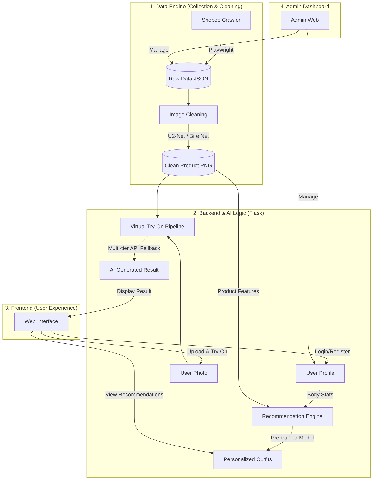

# System Workflow & Technology Stack - Fitting AI

This document summarizes the workflow, tools, and technologies used in the **AI Virtual Fitting & Style Recommendation** system.

## 1. System Workflow

---

## 2. Tools & Technologies

The system is built on a **Full-stack Python & JavaScript** architecture supported by state-of-the-art **AI** models.

### Backend (Processing Hub)
*   **Language:** Python 3.10+
*   **Framework:** **Flask** (Lightweight web server)
*   **Database:** **SQLite** (Manages Users, Products, and Try-on History)
*   **Libraries:** `SQLAlchemy` (ORM), `Flask-CORS`, `python-dotenv`.

### Frontend (User Interface)
*   **Languages:** HTML5, CSS3, JavaScript (Vanilla JS).
*   **Design Style:** **Pastel Minimalism** (Elegant and modern).
*   **Logic:** Uses `fetch` for API communication and dynamic DOM manipulation for AI results.

### AI & ML (Intelligence)
*   **Deep Learning Framework:** **PyTorch** (Used for the Recommender System inference).
*   **Computer Vision:**
    *   **YOLOv8:** Clothing detection and classification.
    *   **U2-Net / BirefNet:** Automatic Background Removal for product cleaning.
*   **Virtual Try-On (VTON):**
    *   **VITON-HD:** High-quality virtual fitting model.
    *   **External APIs:** Integrated **TryOna API**, **Fashn VTON API**, and **API4AI RapidAPI**.

### Data & Tools (Support)
*   **Crawling:** **Playwright** (Browser automation for Shopee data extraction).
*   **Process Management:** **Node.js (npm)** (Uses `npm start` to run Backend & Frontend concurrently).
*   **Environment:** Windows/Linux, utilizes [.env](file:///c:/Mai/4/.env) for secure AI Token management.

---

## 3. Core User Experience Steps
1.  **Crawl & Clean:** The system automatically scrapes garment data and uses AI for background removal.
2.  **Analysis:** Users input their body measurements; AI analyzes their Body Shape.
3.  **Match:** AI suggests the most suitable outfits from the crawled product database.
4.  **Try-On:** Users upload a personal photo, and AI "dresses" the chosen outfit onto the user's photo.
